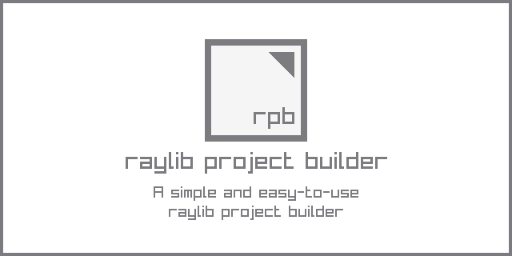

# raylib project builder

A simple and easy-to-use raylib project builder

## raylib project builder Features

 - Multiple platforms building supported: Windows, Linux, Web
 - Configure project build settings in a visual way
 - Automatic assets validation system 
 - Command-line support for autoamted building
 - **Completely portable (single-file, no-dependencies)**
 
## raylib project builder Screenshot

 
## raylib project builder Usage

How to use this tool...

`raylib project builder Desktop` comes with command-line support for batch processing. For usage help:

 > rpb.exe --help

## raylib project builder License

`raylib project builder` is free and open source software.

In any case, consider a donation to help the author keep working on software for games development.

*Copyright (c) 2025-2026 Ramon Santamaria ([@raysan5](https://github.com/raysan5))*
