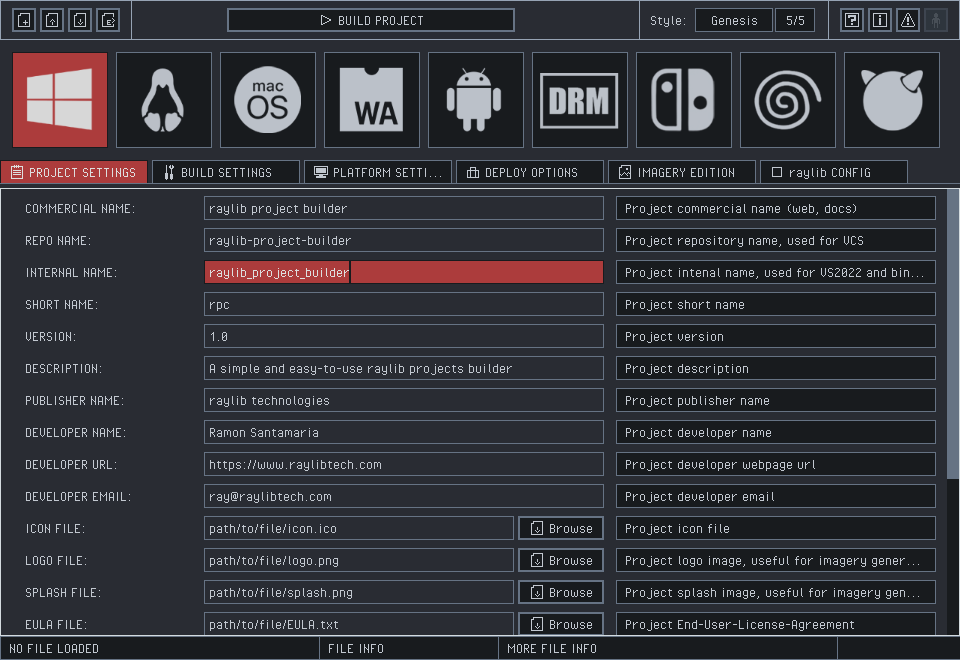

# `rpb` - raylib project builder



### [USE `rpb` TOOL ONLINE!](https://raysan5.itch.io/raylib-project-builder)

## What can I do with `rpb`?

`rpb` can help you to automatically build your raylib projects for multiple platforms. Projects created with `rpc`, raylib project creator, include a `.rpc` file with all the configuration parameters required to automatize project building; `rpb` can read `.rpc` config files and build defined project for multiple platforms. Supported target platforms depend on the Host platform and installed tooling.

## Features

 - Support `.rpc` **project configuration** interchange file format
    - Shared with homonymous tool: [`rpc` - raylib project creator](https://github.com/raysan5/raylib-project-creator)
 - Multiple HOST platforms supported: Windows, Linux, macOS
 - Multiple target platforms supported: Windows, Linux, macOS, Wasm, Android
 - Configure project build settings in a visual way
 - Automatic assets validation, processing and packaging 
 - Command-line support for **automated project building**
 - **Completely portable (single-file, no-dependencies)**
 
## Basic Usage

Open the `rpb` tool desktop interface and open/drag&drop your `.rpc` project file. Once the file open, check project details, some build properties can be configured before building. Once everything ready, click the BUILD button or the Build & Run button. Build process can be followed in the console window opened separately.

**WARNING: Build process is blocking at this moment so the UI tool can look like no-responding, just wait for the process to finish to get control again.**

### Platforms Supported

`rpb` can build for multiple platforms, depending on the Host platform and installed SDKs

| Host Platform | Target Platforms | Notes           |
| :------------ | :--------------: | :-------------- |
| Windows       | Windows<br>Linux<br>Wasm<br>Android |  |
| Linux         | Linux<br>Wasm |  |
| FreeBSD       | FreeBSD |  |
| macOS         | macOS<br>Wasm |  |
| Wasm          | ...  | No targets supported as web-local but any as remote-server frontend |

_NOTE: More platforms can be added in the future_
 
### Build Steps

Project building process consist of multiple steps, depending on the host and target platforms some of those steps are optional or not available.

 1. Setup environment
    - Download and install required SDKs
    - Configure required directories
    - Set environment variables
 2. Build raylib library
    - Set library config options
    - Set default output directories
    - Build raylib with selected configuration
 3. Build project
    - Set output directory with required structure
    - Build project source files (defined by .rpc)
    - Copy binary to build directory
 4. Process assets
    - Process and package assets
    - Copy assets to output build assets path
 5. Package project
    - Sign executable and/or package
    - Compress output build (.zip/.7z)
    - Create installer for target platform
 6. Run project (depends on host platform)

## Project Configuration file

`rpb` supports loading raylib project configuration files: `.rpc`.

`.rpb` configuration files are shared betten `rpc` and `rpb` tools. `rpc` generates a base configuration file on project generation with provided properties and `rpb` can use that config file information to build the project for multiple platforms.

`.rpc` is a text and open file format, following a `.ini` style, and can be freely edited with any text editor.

### Expected project structure

The expected project structure defined by the `.rpc` file should follow the template structure and contrains the following elements:

```
project-repo-name/
├── src/                // Project source code files
│   ├── resources       // Project assets
│   ├── project_name.c
│   └── Makefile        // Project multi-platform Makefile building (default)
├── raylib/             // [OPTIONAL] raylib library sources
├── projects/           // Project build systems, preconfigured
│   ├── VS2022/         // Build system: Visual Studio 2022
│   ├── VSCode/         // Build system: VSCode
│   └── scripts/        // Build system: scripts (.bat, .sh)
├── imagery/            // Project imagery: icons, banners, logo, splash...
├── .github/
│   └── workflows/      // GitHub Actions: Windows, Linux, macOS
├── .gitignore          // Project files to ignore, preconfigured for build systems
├── README.md           // Project main documentation (from template)
├── LICENSE             // Project source code license (MIT by default)
├── EULA.txt            // [OPTIONAL] Project End-User-Agreement
└── project_name.rpc    // Project configuration file, useful for [rpb] tool
```

## Keyboard/Mouse Shortcuts

 - `F1` - Show Help window
 - `F2` - Show About window
 - `F3` - Show Sponsor window

**File Controls**

 - `LCTRL + O - Load project config (.rpc)
 - `LCTRL + S - Save current project config
 - `LCTRL + LSHFT + S - SaveAs current project config

**Build Controls**
 - `LCTRL + B - Build current platform

## Command-line interface

`rpb` dektop version comes with command-line support for automated project building. You can check all available options with the following command:

 > rpb.exe --help

```
USAGE:
    > rpb [--help] --input <project.rpc> [--output build]
          [--build <platform>] [--info]

OPTIONS:
    -h, --help                      : Show tool version and command line usage help
    -i, --input <project.rpc>       : Define input project config file (.rpc)
    -o, --output <path>             : Define output path for build
                                      NOTE: If not defined, using defined one in .rpc
    -b, --build <platform>          : Build project for required platform
                                      NOTE: Supported build platforms depends on HOST platform
    -n, --info                      : Show project information

EXAMPLES:
    > rpb -i cool_game.rpc -o cool_game --build Windows
        Build cool_game for Windows (expecting Windows Host)
    > rpb -i game.rpc
        Build using project defaults
    > rpb -i game.rpc -b Windows
        Build for Windows
    > rpb -i game.rpc -o build -b Linux
        Build for Linux to output build directory
    > rpb -i game.rpc -b Wasm -o ./build/web
        Build to a specific output directory
```

## Technologies

This tool has been created using the following open-source technologies:

 - [raylib](https://github.com/raysan5/raylib) - A simple and easy-to-use library to enjoy videogames programming
 - [raygui](https://github.com/raysan5/raygui) - A simple and easy-to-use immediate-mode-gui library
 - [rini](https://github.com/raysan5/rini) - A simple and easy-to-use config init files reader and writer
 - [tinyfiledialogs](https://sourceforge.net/projects/tinyfiledialogs/) - File dialogs for desktop platforms

## Handmade Software

`rpb` is handmade software, it has been carefully developed using the C programming language, with great attention put on each line of code written.
This approach usually results in highly optimized and efficient code, but it is also more time-consuming and require a higher level of technical skills.
The result is great performance and small memory footprint.

`rpb` is self-contained in a portable package of about **1 MB**.

## Issues & Feedback

Issues and feedback can be reported at https://github.com/raysan5/raylib-project-builder.

For additional support, **priority issues review or tool customization** requests, please contact `ray[at]raylib.com`

## License

This project sources are licensed under an unmodified zlib/libpng license, which is an OSI-certified, BSD-like license that allows static linking with closed source software. Check [LICENSE](LICENSE) for further details.

*Copyright (c) 2025-2026 Ramon Santamaria ([@raysan5](https://github.com/raysan5))*
